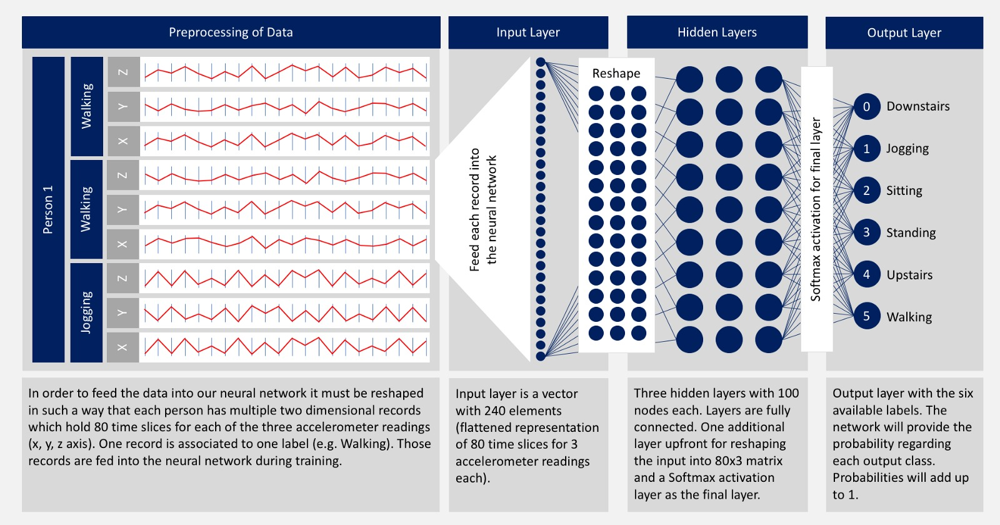

# HumanActivityDetectionWithSmartPhones
CMPE 255 Data Mining Project 

Team-8  
Subhash Polisetti 015286063 
Kanak Kshirsagar 015264106 
Shreshta Balmuri 015442960 
Priyanka Cornelius 015217254 
Shubham Singla 014807221 

# Human Activity Recognition

## Introduction

This project is to build a model that predicts the human activities such as Walking, Walking_Upstairs, Walking_Downstairs, Sitting, Standing or Laying from the smartphone dataset.
This dataset is collected from 30 persons (referred as subjects in this dataset), performing different activities with a smartphone to their waists. The data is recorded with the help of sensors (accelerometer and Gyroscope) in that smartphone. This experiment was video recorded to label the data manually.  

By using the sensors (Gyroscope and accelerometer) in a smartphone, they have captured '3-axial linear acceleration'(tAcc-XYZ) from accelerometer and '3-axial angular velocity' (tGyro-XYZ) from Gyroscope with several variations.  

We will try to implement some classical machine learning algorithms and observe our model performance using F-1 Scores of different algorithms.  

## Features
Smartphone dataset with data points consisting each corresponding to one of the six activities. 
Dataset is built from below 17 signals: 
o	tBodyAcc-XYZ 
o	tGravityAcc-XYZ 
o	tBodyAccJerk-XYZ 
o	tBodyGyro-XYZ 
o	tBodyGyroJerk-XYZ 
o	tBodyAccMag 
o	tGravityAccMag 
o	tBodyAccJerkMag 
o	tBodyGyroMag 
o	tBodyGyroJerkMag 
o	fBodyAcc-XYZ 
o	fBodyAccJerk-XYZ 
o	fBodyGyro-XYZ 
o	fBodyAccMag 
o	fBodyAccJerkMag 
o	fBodyGyroMag 
o	fBodyGyroJerkMag 

We can estimate some set of variables from the above signals. Ie. We will estimate the following properties on each and every signal that we recorded so far. 
o	mean(): Mean value 
o	std(): Standard deviation 
o	mad(): Median absolute deviation 
o	max(): Largest value in array 
o	min(): Smallest value in array 
o	sma(): Signal magnitude area 
o	energy(): Energy measure. Sum of the squares divided by the number of values. 
o	iqr(): Interquartile range 
o	entropy(): Signal entropy 
o	arCoeff(): Autoregression coefficients with Burg order equal to 4 
o	correlation(): correlation coefficient between two signals 
o	maxInds(): index of the frequency component with largest magnitude 
o	meanFreq(): Weighted average of the frequency components to obtain a mean frequency 
o	skewness(): skewness of the frequency domain signal 
o	kurtosis(): kurtosis of the frequency domain signal 

## Goal

1.Performing Exploratory data analysis (EDA) differentiating the six activities(Target Variable)  
 1.1 Sitting  
 1.2 Walking  
 1.3.Walking_upstairs  
 1.4 Walking_downstairs  
 1.5 Lying  
 1.6 Standing  
 into static and Dynamic Activities using visualization techniques. 
 
 
2. Activity Exploration  
    2.1 Are The Activities Separable?  
    2.2 How Good Are The Activities Separable?  
 
 
3. Dimensionality Reduction  
   3.1 Which Perplexity value performs best with TSNE?  
   3.2 Which Sensor Is More Important For Classifying Participants By Walking Style?  
 
 
4. which classifier performs best for the activity detection?  
   4.1 Finding the best estimator with Gridsearch  
   4.2 Finding the Best classifier after performing features reduction

